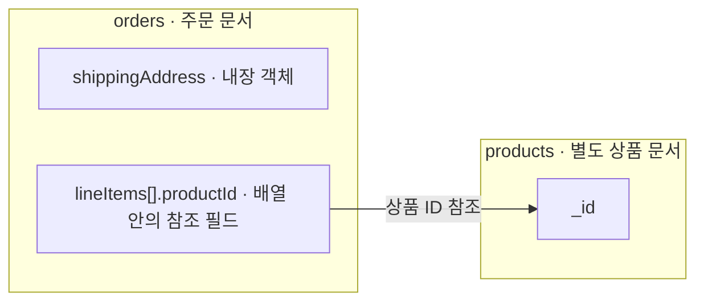
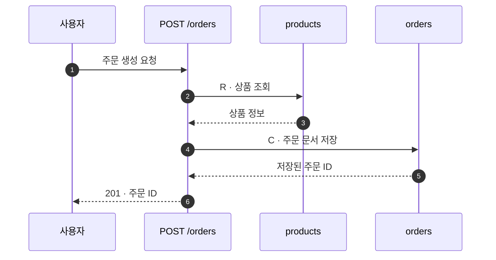

# DB and API information design

Use this guide to explain database structure, API behavior, or an existing technical explainer whose
lists and detail tabs make the overall system hard to understand. Select figures by the reader's
question. A narrow field lookup, ordinary API implementation task, or cosmetic edit does not require
this full workflow. Preserve the requested output format and scope.

This is authoring guidance for the existing skill. It does not introduce schema properties, CLI
commands, a graph renderer, or a dependency on a particular diagram library.

## Start with a reading path

For a broad learning request, use **system overview → one user scenario → API calls and data changes
→ document relationships → individual fields**. Let readers enter a detail directly when that is
their question. Collection counts, storage sizes, and a field dictionary are useful supporting
information; they do not explain ownership or cause and effect on their own.

Write down the audience, the questions they must answer, the scope/revision, and one useful scenario.
Infer these from the request and available material before asking for more information. Select the
smallest set of views that answers those questions. Keep requested coverage reachable through linked
details; do not hide missing coverage behind a simplified overview.

The overview-first approach follows Shneiderman's information-visualization taxonomy. C4 provides
different abstraction levels and recommends using only levels that add value. These are reasons to
separate views, not proof of a universal node count or a guaranteed comprehension time.
[Shneiderman, 1996](https://www.cs.umd.edu/users/ben/papers/Shneiderman1996eyes.pdf),
[C4 diagrams](https://c4model.com/diagrams)

## Match the question to a figure

| Reader question | Figure and visible meaning | Existing output route |
| --- | --- | --- |
| What are the parts and their responsibilities? | System/context map; people, runtimes, stores, external systems, boundaries | `system-architecture` or `container-architecture`; frames |
| What is inside a document and what references another document? | Document relationship map or ERD; exact reference fields and verified constraints | A clearly titled static relationship view using `data-flow`, plus field/constraint tables in the companion note |
| What happens after this user action? | Numbered request sequence; participants, calls, reads/writes, responses, async boundaries | `workflow` with timeline; pair with `api-contract` only when contract detail helps |
| When does a job change state? | State-transition graph; triggers, guards, retries, terminal states | `workflow` with labelled transitions; list guards in the note |
| How does an input become stored data or an output file? | Data flow/lineage; transformation, identity, metadata versus bytes | `data-flow`; use a hub only when it fits the actual ownership |
| What data is affected by this API? | API × collection CRUD matrix; C=create, R=read, U=update, D=delete | Companion Markdown table linked to the API and data views |

These are mappings to generic node/edge views, not claims of specialized ERD, sequence-lifeline, or
state-machine renderer support. `erd`, `sequence`, `state-machine`, and `crud-matrix` are not accepted
`kind` values. Do not add arbitrary properties to strict JSON. Put unsupported notation in a clearly
labelled companion note or a separately requested custom figure. Mermaid is useful for draft
discussion or a requested text diagram; it does not replace validated visual-note specs for exports.

One figure should answer one question at one abstraction level. Declare whether its arrows mean
references, calls over time, data movement, or transitions. Use directional verbs or exact field
pairs; avoid a generic “connected” edge. If two edge meanings are essential, give them explicit
labels and a legend independent of evidence certainty and category colors.
[C4 notation](https://c4model.com/diagrams/notation),
[C4 dynamic views](https://c4model.com/diagrams/dynamic)

## Gather evidence before drawing behavior

Build a small claim ledger in the companion note: concept/relation, meaning, source location,
revision or snapshot date, evidence status, and unresolved questions. Reuse stable semantic IDs across
views for the same concept. An occurrence of one participant at multiple steps can have a distinct
step ID with an explicit link back to that participant; do not turn every step into a new system.

| Claim | Minimum useful evidence | Do not conclude from this alone |
| --- | --- | --- |
| Field and embedded shape | Model/schema, validator, or identified sample | A sample proves that shape exists, not that every document has it |
| Reference and cardinality | Actual read/write relation plus schema/index constraints | Similar field names or current document counts |
| Endpoint contract | OpenAPI or route and request/response validation | `operationId` matching a function does not prove the route binding |
| Call edge and order | Caller body and resolved callee, including dynamic wiring when applicable | A callee symbol merely existing |
| Read/write target | Executed repository/query operation along the traced path | HTTP verb or a method named `save` |
| Atomicity | Actual transaction/session boundary and operations inside it | Statements being adjacent in a service |
| State transition | Assignment or event handler, guard, and retry/error branch | An enum list or a timestamp's name |
| Production state | Identified deployment and observed snapshot/trace, if available | A local branch or static source alone |

Trace the relevant route → handler → service → repository/query path. Use the environment's code
navigation tools to resolve bindings; inspect source when a result is stale or ambiguous. Cite the
caller or query body for behavior, not just the destination symbol. A successful evidence-path or
schema validation proves structural validity, not that the cited code entails the explanation.

For API behavior, capture request/response, permission conditions, reads, writes, changed fields,
failure/retry paths, and transaction or asynchronous boundaries only to the depth the question needs.
OpenAPI describes the public operation contract; DB dependencies and internal execution order need
implementation evidence. Mark unresolved wiring as `question`, or a reasoned hypothesis as
`inference`; do not fill missing steps with a plausible happy path.
[OpenAPI Specification](https://spec.openapis.org/oas/latest.html)

Keep implementation facts, inferred design intent, and proposed changes distinct. A proposal is not
a fourth `status` enum: label its view and claims as proposed and use the existing evidence statuses
appropriately. Do not invent an implemented revision for an unimplemented proposal. When source,
deployment, and DB snapshot differ, expose those scopes instead of merging them into “current”.

## Draw document structure faithfully

- Show a document boundary and its embedded objects/arrays by containment. For deeper nesting than
  the renderer supports, use labelled field paths in the note instead of inventing nested-frame JSON.
- Use inter-document edges for references, with exact source and target fields. Connect to field
  rows when a custom renderer supports it; otherwise retain the field pair on the edge or note.
- An ID reference is not an enforced foreign key. Distinguish application checks, unique/partial
  indexes, schema validators, and database-enforced constraints.
- Show optionality, nullability, one-to-many, or uniqueness only when supported. Label conceptual
  cardinality separately if enforcement is absent or unknown.
- In detail tables use one actual field path per row, its own type, meaning, and constraints. Do not
  combine unrelated fields as `customerId / orderId`. Preserve literal slashes that are part of a
  real identifier or API path; composite indexes remain a list of their participating fields.
- Keep overview nodes short. Put the selected join/reference keys on the graph and the complete
  requested field coverage in the detail layer. Arrays are not separate collections merely because
  they have multiple entries.

MongoDB's embedding/reference distinction is the basis for this visual grammar, not a recommendation
to normalize every embedded object. Explain tradeoffs from the actual access patterns.
[MongoDB relationships](https://www.mongodb.com/docs/manual/applications/data-models-relationships/)

## Use different figures for structure and execution

The following is a **synthetic teaching example**, not a claim about the user's repository or a
complete runtime fixture. Assume the example contract explicitly states that `POST /orders` reads
`products`, inserts an `orders` document, then responds with 201. The order contains `shippingAddress`
and `lineItems`; `lineItems[].productId` references `products._id`.

For “where does the data live?”, use containment and references:

For “what does this request do?”, keep time and operation labels explicit:

The sequence explains only the stipulated successful path. It establishes no transaction, rollback,
payment behavior, authorization rule, or retry policy. In a real task, cite implementation evidence
or disclose the missing proof for each of those claims before adding them.

For state explanations, keep stored status, derived UI state, and timing conditions separate. A
persisted result waiting for `visibleAt` is not necessarily a still-running worker. Explain how the
display state is derived rather than inventing one stored enum for every visible label. State
documentation such as Stripe's PaymentIntent lifecycle is useful for explaining transition and
retry conditions; do not reuse its states as facts about another application.
[Stripe lifecycle](https://docs.stripe.com/payments/paymentintents/lifecycle)

## Link the views without losing context

For static notes, use an overview, scenario links, previous/next navigation, and a return link from
each detail to its parent. For an explicitly requested interactive explorer, use a stable central
map and an adjacent inspector or mobile drawer:

| Interaction | What should change | What should remain stable |
| --- | --- | --- |
| Choose a user scenario | Relevant path is emphasized; steps become available | Concept IDs, terminology, evidence, and useful map positions |
| Select an API | Show its role, request/response, reads/writes, and relevant failures | The surrounding path and selected scenario |
| Select a collection | Show related operations, reference keys, fields, and constraints | The reader's place in the graph |
| Advance a step | Highlight the current call and the affected data | Shared participants and the ability to return |
| Open an improvement | A separately labelled current/proposed comparison | Corresponding concept identities and provenance |
| Change explanation level | Wording density | Facts, identifiers, uncertainty, topology, and evidence |

Begin with an overview sized to fit its purpose, not all collections and fields. A handful of primary
nodes is an initial design choice, not a scientific limit. Keep selected positions and the viewport
stable across ordinary selection/filtering; remeasure/re-layout when actual dimensions require it.
Use user-controlled stepping rather than automatic motion by default. Provide labelled keyboard
controls, a visible selection/focus state, and non-color cues. Exports retain title, scope, legend,
and source revision/date so a static figure remains understandable.

Useful primary examples are the [C4 drill-down example](https://c4model.com/example/),
[AWS Workflow Studio's graph and inspector](https://docs.aws.amazon.com/step-functions/latest/dg/workflow-studio.html),
and [React Flow's field-connected schema nodes](https://reactflow.dev/ui/components/database-schema-node).
Borrow the information pattern without implying those tools are installed or mandatory. React Flow
does not supply automatic layout by itself; choose a stable fixed layout or a suitable layout engine
only when implementing that output. [React Flow layout guidance](https://reactflow.dev/learn/layouting/layouting)

These interaction concepts do not add `reads`, `writes`, or `fields` to the v2 entity `details` JSON.
Use the supported dimensions and companion notes, or keep additional UI data explicitly outside
that contract. Follow [render-independent-authoring-contract.md](render-independent-authoring-contract.md)
when selecting that mode. Its before/after revisions and strict detail dossier must remain truthful;
a scenario focus is not a code change. Typography and geometric QA still apply independently.

## Review meaning as well as rendering

Use these checks when the change affects the corresponding explanation. Do not manufacture a user
study or require every check for a one-field answer.

1. **Evidence:** Can each important call, reference, write, and transition be traced to proof of that
   relationship, not merely an existing name? Are implementation, inference, proposal, and unknowns
   distinguishable? Do revision and snapshot scopes remain visible?
2. **Grammar:** Does each figure say what its boxes and arrows mean? Can the reader distinguish an
   embedded value, a separate document, a runtime call, and a state transition?
3. **Coverage:** Are omitted overview details reachable? Does the field/API inventory account for
   the requested scope without making the overview unreadable?
4. **Comprehension:** Can a reader locate where data lives, explain one action's reads/writes,
   distinguish processing from display delay, and identify a missing fact without outside coaching?
   Record correctness, time, and navigation mistakes only if actually observed.
5. **Rendering and interaction:** Validate specs; inspect the requested output; for web artifacts,
   check the actual viewport, label overlap, inspector overflow, keyboard navigation, and preservation
   of selection/evidence while stepping or changing detail. A passing JSON check proves none of these
   browser or comprehension results.

Avoid a giant ERD as the only entry point, decorative moving graphs, unexplained acronyms, a new page
for every click, and identical-looking arrows for unrelated meanings. Keep a CRUD matrix as an
impact-analysis option when relationship lines become too dense, with unknown cells marked unknown
rather than silently blank.

## Review cases for skill changes

Use these as small behavioral probes when changing this guidance. They are evaluation scenarios,
not instructions to generate all outputs during every task.

| Request and available input | Behavior to look for |
| --- | --- |
| “Explain this database”; 20 collections and a long field list | Lead with roles and relationships, choose a scenario where helpful, retain searchable detail; do not deliver only 20 cards |
| “Map POST /orders to the DB”; only OpenAPI and a method named `saveOrder` exist | Explain the known contract, mark writes/call wiring unproven, and identify the code needed; do not infer an insert from the name or POST verb |
| An `orders` sample embeds `shippingAddress` and refers to `products` through `lineItems[].productId` | Separate containment from reference; do not claim collection-wide requiredness or foreign-key enforcement from a sample |
| “Explain why completed work still looks pending”; code separates worker completion from `visibleAt` | Show actual completion and derived display timing separately, citing both conditions |
| “Show the current DB interactively”; only one known Git revision exists | Keep that real revision; use truthful identical phases if appropriate or the regular linked views; no invented before/after commits or unsupported enums |
| “List the type of customerId” | Answer that field directly; do not force a system map, state diagram, or browser app |

When reporting delivery, distinguish authored guidance, validated specs, rendered artifacts, browser
observations, and actual comprehension findings. Reference links in this guide are optional background;
ordinary local generation can remain offline under the skill's existing boundary.
